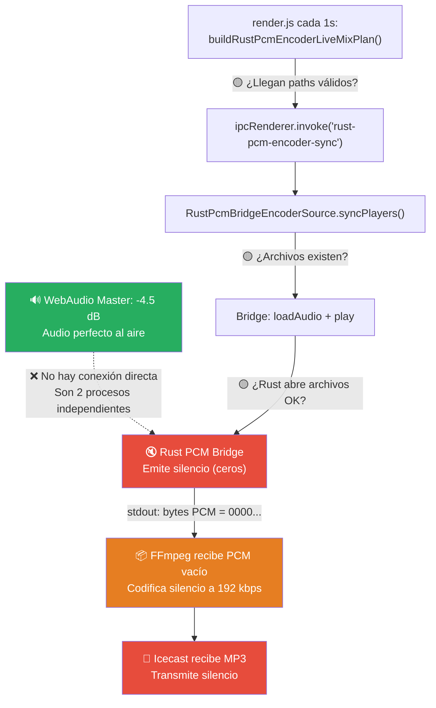

# 🛠️ Plan de Reparación: Encoder Sin Audio desde Rust

> **Estado:** ⏳ Pendiente de autorización del usuario  
> **Prohibición activa:** NO se tocará código hasta aprobación  
> **Fecha:** 2026-05-13

---

## 📸 Lo Que Veo en las Capturas

### Encoder (Captura 1)
| Elemento | Valor | Veredicto |
|---|---|---|
| Estado | `EN VIVO (ON AIR)` | ✅ Conectado |
| Bitrate | `192 kbps, speed 1.08x` | ✅ FFmpeg codificando |
| Stream estable | `Sí` | ✅ FFmpeg recibe bytes |
| **ENTRADA AL ENCODER** | **Pico: -inf / RMS: -inf** | ❌ **SIN AUDIO** |
| Proveedor | `rustAudioEngine` | ✅ Correcto |
| Silencio | `silencio 1...` (1+ segundo) | ❌ **Audio vacío** |

### Consola Virtual (Captura 2)
| Elemento | Valor | Veredicto |
|---|---|---|
| Motor | `rustAudio` solicitado y activo | ✅ |
| MASTER VU | **-4.5 dB** | ✅ **HAY AUDIO en WebAudio** |
| player-b | `play g=1.000 81s/253s [ref]` | ✅ Reproduciendo |
| Rust now | `Angel y Khriz - Me Enamoré` | ✅ Sabe qué canción |
| Rust transport | `playing 79s/253s` | ✅ Sincronizado |
| Rust shadow | `player-b listo, delta ~40ms` | ✅ Shadow activo |
| Encoder | `activo, rustAudioEngine, pcm_s16le...` | ✅ Config correcta |
| **Rust encoder** | **Encoder: activo \| rustAudioEngine \| pcm_sile...** | ⚠️ **"pcm_sile..." = silencio** |

---

## 🎯 Diagnóstico Confirmado

> [!CAUTION]
> **El encoder ESTÁ conectado y FFmpeg ESTÁ recibiendo bytes PCM, pero esos bytes son silencio puro (todo ceros).** El master de WebAudio suena perfectamente (-4.5 dB), pero el PCM bridge de Rust no está reproduciendo nada.

### Cadena de Causalidad Confirmada



---

## 🔍 El Problema Real: ¿Dónde Está la Rotura?

Tras analizar toda la cadena, la rotura está en **uno de estos 3 puntos del sync loop**:

### Punto de Falla A: `buildRustPcmEncoderLiveMixPlan()` retorna vacío
**Ubicación:** [render.js L7414-7467](file:///c:/LF%20Automatizador%20v1.0/frontend/render.js#L7414-L7467)

Esta función lee `buildWebAudioEngineDiagnostics().mix.players` y filtra por `player?.path && player.active`. Si el `path` del mix player es vacío o nulo, el plan sale vacío y **el bridge Rust nunca recibe archivos para decodificar**.

Mirando el código de `describeMixPlayer` ([render.js L5245](file:///c:/LF%20Automatizador%20v1.0/frontend/render.js#L5245)):
```javascript
path: meta.filePath || ''
```
Donde `meta` viene de `playerPlaybackMeta.get(player)`. Si la meta no se setea o `filePath` está vacío, `path` será `''` y el player se filtra.

### Punto de Falla B: `normalizePcmBridgePlayerPlans()` filtra archivos inexistentes
**Ubicación:** [audio_engine_process.js L668](file:///c:/LF%20Automatizador%20v1.0/backend/audio_engine_process.js#L668)

```javascript
.filter(item => item.path && fs.existsSync(item.path));
```

Si el path llega con formato incorrecto (URL vs path, encoding de caracteres) o si los archivos aleatorios (`/Aleatorio...`) se resuelven con una ruta que el backend no puede leer, los planes se filtran.

### Punto de Falla C: Rust no puede abrir el archivo
**Ubicación:** [main.rs L841-853](file:///c:/LF%20Automatizador%20v1.0/audio-engine-rust/src/main.rs#L841-L853)

Si Rust no puede decodificar el codec del archivo (por ejemplo, ciertos MP3/M4A que symphonia no soporta), emite un error a stderr pero sigue enviando PCM de ceros por stdout.

---

## 📋 Plan de Trabajo (Propuesta)

### Fase 0: Diagnóstico Rápido (5 minutos, sin tocar código)
> Agregar logging temporal para confirmar exactamente cuál punto de falla es el activo.

| # | Acción | Archivo | Qué se añade |
|---|---|---|---|
| 0.1 | `console.log` en `buildRustPcmEncoderLiveMixPlan()` | `render.js` | Log del array `sources[]` antes de retornar |
| 0.2 | `console.log` en `syncPlayers()` | `audio_engine_process.js` | Log de `plans.length` y `plans[0]?.path` |
| 0.3 | Verificar logs existentes | Terminal | Buscar `"Rust PCM encoder source: fuentes="` |

### Fase 1: La Reparación Real (estimado: 15-25 minutos)

Según lo que confirme la Fase 0, atacaremos **uno** de estos:

#### Opción 1A: Si el plan llega vacío (`fuentes=0`)
**Causa:** `describeMixPlayer` no retorna `path` porque `playerPlaybackMeta` no tiene `filePath` para el player activo.

**Solución:** Asegurar que `buildRustPcmEncoderLiveMixPlan()` tenga un fallback robusto que lea el path directamente de `currentPlayingRow?.dataset?.ruta` si la meta del player no lo tiene.

| Archivo | Cambio |
|---|---|
| `render.js` | Mejorar `buildRustPcmEncoderLiveMixPlan()` con fallback de path desde row dataset |

#### Opción 1B: Si el plan llega con paths pero son filtrados por `fs.existsSync`
**Causa:** El path llega como file URL (`file:///C:/...`) en vez de path nativo (`C:\...`), o con encoding diferente.

**Solución:** Normalizar el path en `normalizePcmBridgePlayerPlans()` antes del `existsSync`.

| Archivo | Cambio |
|---|---|
| `audio_engine_process.js` | Agregar normalización de path (file URL → native path) |

#### Opción 1C: Si el plan llega completo pero Rust no puede abrir el archivo  
**Causa:** Symphonia/Rodio no soporta el codec específico.

**Solución:** Esto requiere cambio en el Rust o filtrar formatos no soportados en el plan.

| Archivo | Cambio |
|---|---|
| `main.rs` | Mejorar manejo de errores en `open_pcm_source()` |
| `audio_engine_process.js` | Filtrar archivos por extensiones soportadas |

### Fase 2: Mejora de UX del Encoder (sugerencia aceptada, 10-15 min)

> [!TIP]
> **Tu sugerencia de agregar un selector WebAudio/Rust en el encoder es excelente.** Actualmente no existe forma de elegir manualmente la fuente del encoder — siempre se resuelve automáticamente desde `audioEngineMode`. Agregar esta opción permitiría:
> 1. Usar WebAudio (que funciona) mientras se diagnostica Rust
> 2. Dar control al operador sobre qué fuente alimenta el stream

| Archivo | Cambio |
|---|---|
| `encoder.html` | Agregar `<select>` para elegir fuente: Auto / WebAudio / Rust |
| `encoder.js` | Incluir `encoderProvider` en el config que se envía |
| `encoder_prefs.json` | Persistir la preferencia |

---

## 🧭 Mi Recomendación de Ataque

> [!IMPORTANT]
> **NO hay que atacar el encoder directamente.** El encoder está funcionando correctamente (se conecta, FFmpeg codifica, transmite). El problema está **en el trayecto**: el sync loop que alimenta archivos al bridge Rust.

### Orden Recomendado:

1. **Fase 0** — Confirmar el punto exacto de falla (5 min de logs)
2. **Fase 1** — Reparar el punto de falla identificado (15-25 min)
3. **Fase 2** — Agregar selector de fuente en el encoder UI (10-15 min, opcional pero valioso)

### ¿Qué NO hay que tocar?
- ❌ `main.js` — No es necesario
- ❌ El motor Rust principal (`main.rs`) — A menos que sea Opción 1C
- ❌ La lógica de FFmpeg — Funciona perfectamente
- ❌ La conexión IPC — Funciona perfectamente

### ¿Dónde SÍ hay que intervenir?
- ✅ `render.js` — En `buildRustPcmEncoderLiveMixPlan()` y/o `describeMixPlayer()`
- ✅ Posiblemente `audio_engine_process.js` — En `normalizePcmBridgePlayerPlans()`
- ✅ Opcionalmente `encoder.html` + `encoder.js` — Para el selector de fuente

---

## ⏳ Esperando Tu Autorización

Necesito tu decisión sobre:

1. **¿Procedemos con la Fase 0** (logs diagnósticos) para confirmar el punto exacto?
2. **¿Quieres que incluya la Fase 2** (selector WebAudio/Rust en el encoder)?
3. **¿Alguna prioridad diferente?** (por ejemplo, hacer funcionar el encoder con WebAudio como workaround rápido mientras se arregla Rust)
